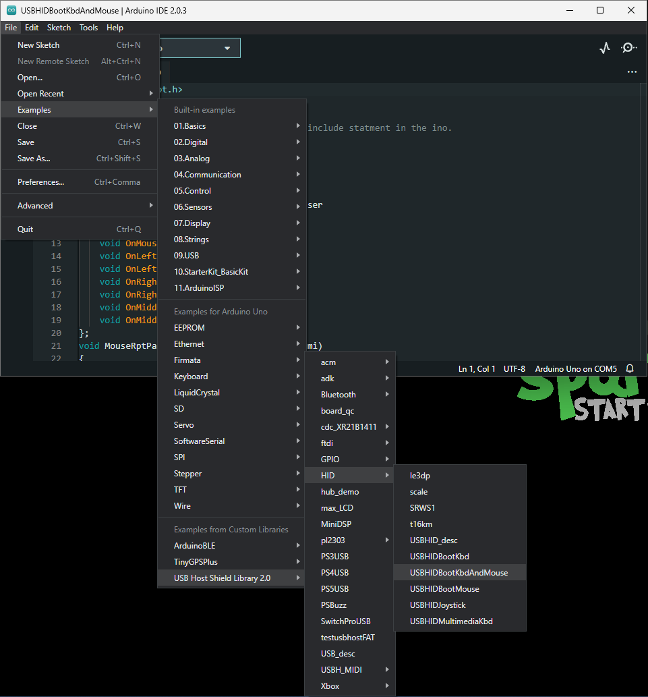

## HID Keyboard and Mouse
In this example, we will be utilizing the [USBHIDBootKbdAndMouse](https://github.com/felis/USB_Host_Shield_2.0/tree/master/examples/HID/USBHIDBootKbdAndMouse) example from the [USB_Host_Shield_2.0 Arduino library](https://github.com/felis/USB_Host_Shield_2.0). This example can be found in the **File** dropdown menu _(i.e. (1) **File** > **Examples** > **USB Host Shield Library 2.0** > **HID** > **USBHIDBootKbdAndMouse**)_. Once the example has been opened, users should see the `USBHIDBootKbdAndMouse.ino` example sketch.
{ .annotate }

1. <figure markdown>
    [](../assets/img/software/example-kbd_mouse.png)
    <figcaption markdown>Select the `USBHIDBootKbdAndMouse` example sketch from the `File` drop-down menu.</figcaption>
    </figure>

??? code "USBHIDBootKbdAndMouse.ino"
    ``` c++ linenums="1"
    --8<-- "https://raw.githubusercontent.com/felis/USB_Host_Shield_2.0/master/examples/HID/USBHIDBootKbdAndMouse/USBHIDBootKbdAndMouse.ino"
    ```

Users will need to connect an HID device *(keyboard and/or mouse)* to the USB-C host shield with a USB cable, before running the example. After the example begins, users should see an output in the [Serial Monitor](https://learn.sparkfun.com/tutorials/112) with print out based on the user's interaction with their HID device.