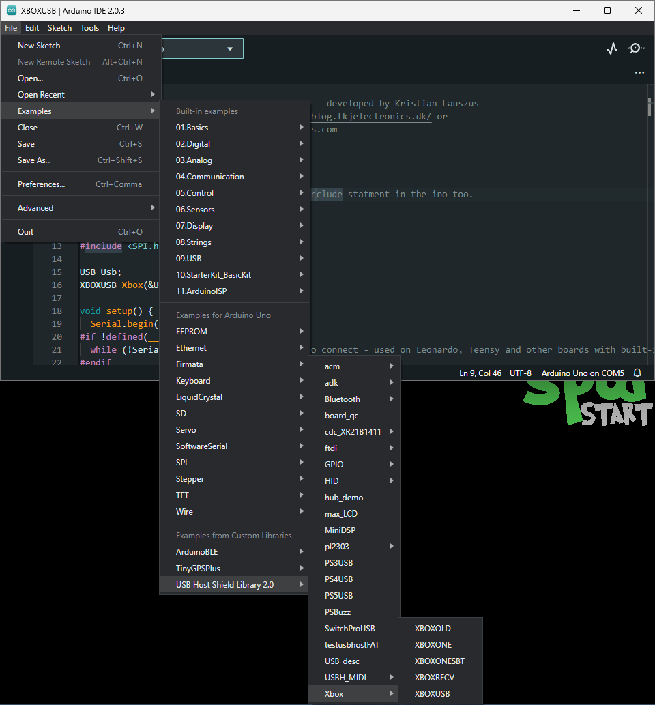
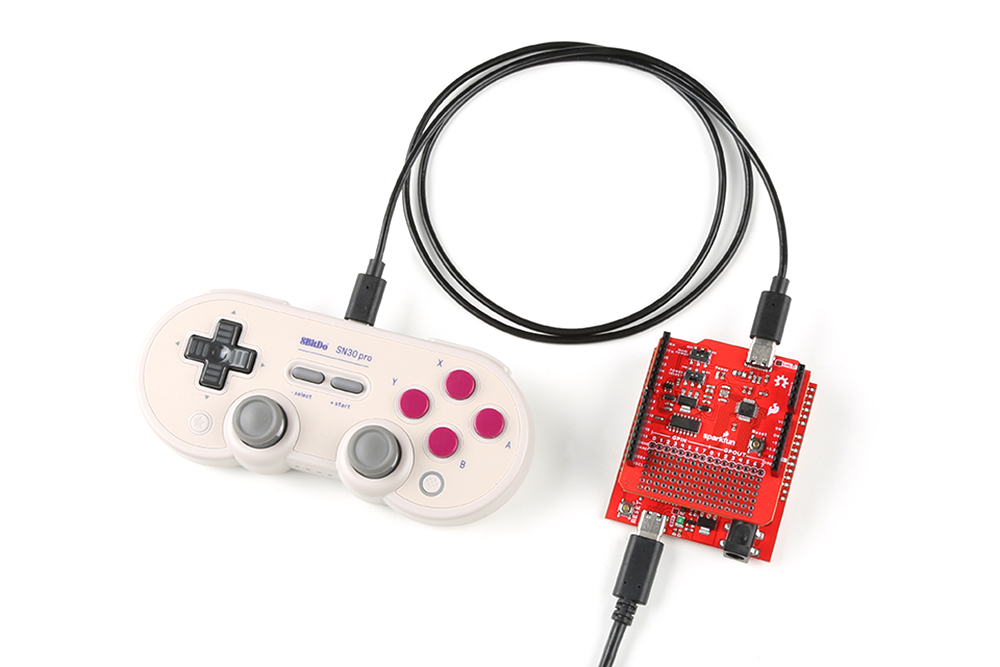
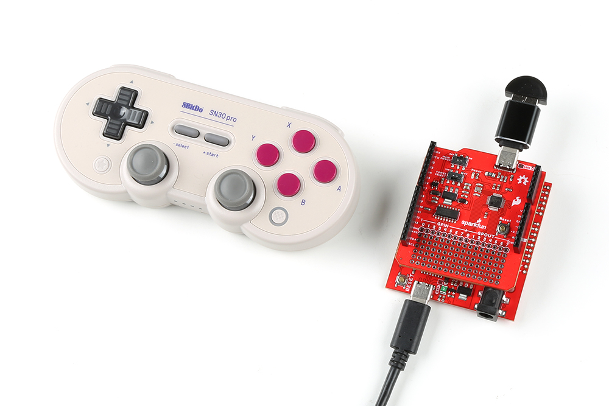

## HID Game Controller

In these examples, we will be connecting the [8BitDo SN30 Pro](https://www.sparkfun.com/products/17264) to the USB-C host shield. Users will need the following items for the examples below:

<ul class="pdf" markdown>
  <li markdown>
  [8BitDo SN30 Pro Bluetooth Gamepad](https://www.sparkfun.com/products/17264)<br>
  For instructions on how to use the 8BitDo SN30 Pro, please refer to their [user manual](https://download.8bitdo.com/Manual/Controller/SN30pro+SF30pro/SN30pro_Manual.pdf).
  </li>
  <li markdown>[USB 2.0 Type-C Cable - 1 Meter](https://www.sparkfun.com/products/16905)</li>
  <li markdown>[USB A (Female) to Type C (Male) Converter](https://www.sparkfun.com/products/21870)</li>
  <li markdown>[Bluetooth USB Module Mini](https://www.sparkfun.com/products/9434)</li>
</ul>

<div class="grid cards" markdown>

-   <a href="https://www.sparkfun.com/products/17264">**8BitDo SN30 Pro Bluetooth Gamepad**<br>
	WIG-17264

	---

	<figure markdown>
	
	</figure></a>

	??? info "8BitDo SN30 Pro Manual"
		For instructions on how to use the 8BitDo SN30 Pro, please refer to their [user manual](https://download.8bitdo.com/Manual/Controller/SN30pro+SF30pro/SN30pro_Manual.pdf).

-   <a href="https://www.sparkfun.com/products/16905">**USB 2.0 Type-C Cable - 1 Meter**<br>
	CAB-16905

	---

	<figure markdown>
	
	</figure>
	</a>

-   <a href="https://www.sparkfun.com/products/21870">**USB A (Female) to Type C (Male) Converter**<br>
	COM-21870

	---

	<figure markdown>
	
	</figure>
	</a>

-   <a href="https://www.sparkfun.com/products/9434">**Bluetooth USB Module Mini**<br>
	WRL-09434

	---

	<figure markdown>
	
	</figure>
	</a>

</div>

### USB Connection

In this example, we will be utilizing the [XBOXUSB](https://github.com/felis/USB_Host_Shield_2.0/tree/master/examples/Xbox/XBOXUSB) example from the [USB_Host_Shield_2.0 Arduino library](https://github.com/felis/USB_Host_Shield_2.0). This example can be found in the **File** dropdown menu _(i.e. (1) **File** > **Examples** > **USB Host Shield Library 2.0** > **Xbox** > **XBOXUSB**)_. Once the example has been opened, users should see the `XBOXUSB.ino` example sketch.
{ .annotate }

1. <figure markdown>
    [](../assets/img/software/example-xbox.png)
    <figcaption markdown>Select the `XBOXUSB` example sketch from the `File` drop-down menu.</figcaption>
    </figure>

??? code "XBOXONE.ino"
	```  c++ linenums="1"
	--8<-- "https://raw.githubusercontent.com/felis/USB_Host_Shield_2.0/master/examples/Xbox/XBOXUSB/XBOXUSB.ino"
	```

Users will need to turn on and connect the controller to the USB-C host shield with a USB cable, before running the example.

<figure markdown>
[{ width="400" }](../assets/img/software/usb_controller.jpg)
<figcaption markdown>8BitDo controller connected to the USB-C Host Shield with a USB-C cable.</figcaption>
</figure>

!!! note
	To turn on the controller, press the ++"Start"+"X"++ buttons. Users should see two status LEDs blinking at the bottom of the controller.

After the example begins, users should see an output in the [Serial Monitor](https://learn.sparkfun.com/tutorials/112) with print out based on the user's interaction with their controller.

### Bluetooth Connection

In this example, we will be utilizing the [XBOXONESBT](https://github.com/felis/USB_Host_Shield_2.0/tree/master/examples/Xbox/XBOXONESBT) example from the [USB_Host_Shield_2.0 Arduino library](https://github.com/felis/USB_Host_Shield_2.0). This example can be found in the **File** dropdown menu _(i.e. (1) **File** > **Examples** > **USB Host Shield Library 2.0** > **Xbox** > **XBOXONESBT**)_. Once the example has been opened, users should see the `XBOXONESBT.ino` example sketch.
{ .annotate }

1. <figure markdown>
    [](../assets/img/software/example-xbox.png)
    <figcaption markdown>Select the `XBOXONESBT` example sketch from the `File` drop-down menu.</figcaption>
    </figure>

??? code "XBOXONESBT.ino"
	``` c++ linenums="1"
	--8<-- "https://raw.githubusercontent.com/felis/USB_Host_Shield_2.0/master/examples/Xbox/XBOXONESBT/XBOXONESBT.ino"
	```

Users will need to connect the Bluetooth USB module to the USB-C host shield with the USB adapter before running the example. After the example begins, users should see an output in the [Serial Monitor](https://learn.sparkfun.com/tutorials/112) with print out based on the user's interaction with their controller.

<figure markdown>
[{ width="400" }](../assets/img/software/bt_controller.jpg)
<figcaption markdown>Bluetooth module connected to the USB-C Host Shield; and paired with an 8BitDo controller.</figcaption>
</figure>

!! note
	Make sure to wait until after the board restarts and executes the example, before pairing the 8BitDo controller with the Bluetooth module.

#### Bluetooth Pairing the Controller

To turn on the controller, press the ++"Start"+"X"++ buttons. Users should see two status LEDs blinking at the bottom of the controller. To pair the controller, press and hold the pair button at the top of the controller, next to the USB-C connector, for 3 seconds. Once paired, the controller should vibrate.