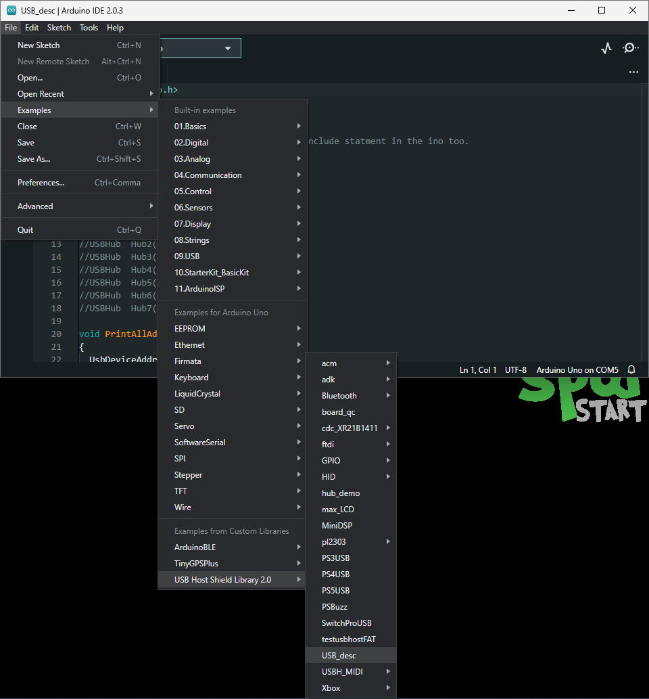

## USB Description
For our first example, we will be utilizing the [USB_dec](https://github.com/felis/USB_Host_Shield_2.0/tree/master/examples/USB_desc) example from the [USB_Host_Shield_2.0 Arduino library](https://github.com/felis/USB_Host_Shield_2.0). This example can be found in the **File** dropdown menu _(i.e. (1) **File** > **Examples** > **USB Host Shield Library 2.0** > **USB_Desc**)_. Once the example has been opened, users should see two files `USB_desc.ino` and `pgmstrings.h`.
{ .annotate }

1. <figure markdown>
    [](./assets/img/software/example-usb_desc.png)
    <figcaption markdown>Select the `USB_Desc` example sketch from the `File` drop-down menu.</figcaption>
    </figure>

??? code "Example Files"
    === "USB_desc.ino"

        ``` c++ linenums="1"
        --8<-- "https://raw.githubusercontent.com/felis/USB_Host_Shield_2.0/master/examples/USB_desc/USB_desc.ino"
        ```

    === "pgmstrings.h"
    
        ``` c++ linenums="1"
        --8<-- "https://raw.githubusercontent.com/felis/USB_Host_Shield_2.0/master/examples/USB_desc/pgmstrings.h"
        ```

Users will need to connect a peripheral USB device to the USB-C connector, before running the example. After the example begins, users should see an output in the [Serial Monitor](https://learn.sparkfun.com/tutorials/112) with a description of the connected USB device.

<figure markdown>
[{ width="400" }](./assets/img/hardware/assembly-usb_device.jpg)
<figcaption markdown>The USB Host Shield with a [USB-C adapter](https://www.sparkfun.com/products/21870) and [flash drive](https://www.sparkfun.com/products/14658) attached.</figcaption>
</figure>

??? tip "USB Hubs"
    If users connect [USB hubs](https://en.wikipedia.org/wiki/USB_hub) or USB cables with a hub to the USB host shield, utilize the [hub_demo](https://github.com/felis/USB_Host_Shield_2.0/tree/master/examples/hub_demo) example from the [USB_Host_Shield_2.0 Arduino library](https://github.com/felis/USB_Host_Shield_2.0) instead. This example can be found in the **File** dropdown menu _(i.e. **File** > **Examples** > **USB Host Shield Library 2.0** > **hub_demo**)_ and will list the USB description for the hub(s) and all the peripheral devices connected to the hub(s).

    ??? info "Only interested in the USB hub description?"
        To see just the USB description for the hub(s) connected to the USB host shield, follow the information in the [library's FAQ](https://github.com/felis/USB_Host_Shield_2.0#faq). Utilizing the [USB_dec](https://github.com/felis/USB_Host_Shield_2.0/tree/master/examples/USB_desc) example, uncomment [lines 12-18](https://github.com/felis/USB_Host_Shield_2.0/blob/master/examples/USB_desc/USB_desc.ino#L12-L18)(1).
        { .annotate }

        1. Each instance of `#!c++ USBHub  Hub<number>(&Usb);` enables a USB hub, but the library is limited up to **seven** USB hubs. 

        ``` c++ linenums="11" hl_lines="2-8" title="USB_desc.ino"
        --8<-- "https://raw.githubusercontent.com/felis/USB_Host_Shield_2.0/master/examples/USB_desc/USB_desc.ino:11:19"
        ```


    <div class="grid cards" markdown>

    -   <a href="https://www.sparkfun.com/products/18014">**Qwiic USB Hub - USB2514B**<br>
        SPX-18014

        ---

        <figure markdown>
        
        </figure></a>

    -   <a href="https://www.sparkfun.com/products/21271">**SparkFun 4-in-1 Multi-USB Cable - USB-C Host**<br>
        CAB-21271

        ---
        
        <figure markdown>
        
        </figure></a>

    -   <a href="https://www.sparkfun.com/products/21272">**SparkFun 4-in-1 Multi-USB Cable - USB-A Host**<br>
        CAB-21272

        ---

        <figure markdown>
        
        </figure></a>

    </div>