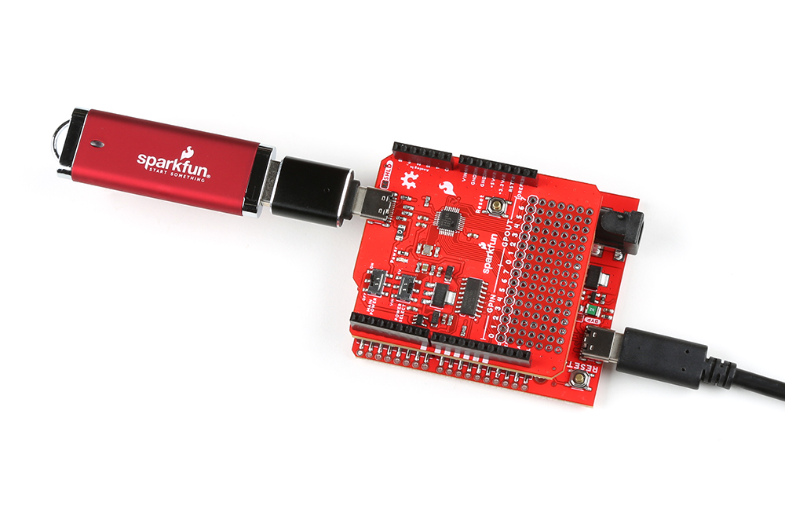

!!! tip
	Users unfamiliar with using Arduino shields should refer to the [Arduino Shields (v2)](https://learn.sparkfun.com/tutorials/arduino-shields-v2) tutorial first.

	

	-   <a href="https://learn.sparkfun.com/tutorials/1167">
		<figure markdown>
		
		</figure>

		---
		
		**Arduino Shields v2**</a>

	

## Headers
The pins for the USB Host Shield are broken out to 0.1"-spaced pins on the outer edges of the board. When selecting headers, be sure you are aware of the functionality you need.

<figure markdown>
[{ width="400" }](./assets/img/hardware/assembly-headers.jpg)
<figcaption markdown>Soldering headers to the USB Host Shield.</figcaption>
</figure>

!!! tip "New to soldering?"
	Check out our [How to Solder: Through-Hole Soldering](https://learn.sparkfun.com/tutorials/5) tutorial for a quick introduction!

	

	-   <a href="https://learn.sparkfun.com/tutorials/5">
		<figure markdown>
		
		</figure>

		---

		**How to Solder: Through-Hole Soldering**</a>

	

The [Arduino Stackable Header Kit - R3](https://www.sparkfun.com/products/11417) is a great option as it allows users to stack shields (*w/ Uno/R3 footprint*); with the pins still accessible through the female headers.

<figure markdown>
[{ width="400" }](./assets/img/hardware/assembly-stack_shield.jpg)
<figcaption markdown>Stacking the USB Host Shield on the [SparkFun RedBoard Plus](https://www.sparkfun.com/products/18158).</figcaption>
</figure>

## USB Device
The USB port is utilized for the host/peripheral interface. Users only need to connect a USB device to the USB host shield or connect the shield to a computer with a USB-C cable.

<figure markdown>
[{ width="400" }](./assets/img/hardware/assembly-usb_device.jpg)
<figcaption markdown>The USB Host Shield with a [USB-C adapter](https://www.sparkfun.com/products/21870) and [flash drive](https://www.sparkfun.com/products/14658) attached. The shield sits on top of a RedBoard Plus connected to a computer.</figcaption>
</figure>