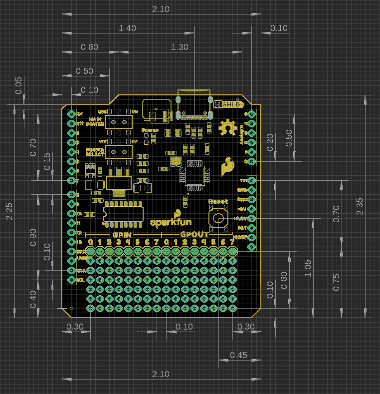

## Board Dimensions
The board dimensions are illustrated in the drawing below; the listed measurements are in inches.

[{ width="400" }](./img/hookup_guide/dimensions.png) 
*[Board dimensions (PDF)](./board_files/dimensions.pdf) for the USB Host Shield, in inches. (Click to enlarge)*

## Power
The MAX3421E USB controller only requires **3.3V** to operate; however, the shield is powered entirely through either the `5V` or `VIN` pins of the connected Arduino board.

[{ width="200" }](./img/hookup_guide/power_connections2.jpg) 
*USB Host Shield power connections. (Click to enlarge)*

Below, is a general summary of the power circuitry on the board:

* **`VIN`** - Provides a regulated 3.3V and 5V for the shield
    * To utilize this pin, users will need to connect an external power source to the barrel jack of the Arduino board they are using.
* **`5V`** - Provides 5V and a regulated 3.3V for the shield
* **`GND`** - The common ground or the 0V reference for the voltage supplies.
* **`VBUS`** - The voltage to the USB-C connector (**5V**)
    * The available current is limited to what is supplied from the `VIN`/`5V` pin, up to the 500 mA threshold of the thermal fuse.

*For more details, users can reference the [schematic](./board_files/schematic.pdf) and the [datasheets of the individual components](./component_documentation.md) in the power circuitry.*

### Power LED
The red, power (`PWR`) LED will light up once **5V** is supplied to the shield. For most users, it will light up when power is supplied to the connected Arduino board.

[{ width="200" }](./img/hookup_guide/LED_pwr.jpg) 
*USB Host Shield `PWR` status LED indicator. (Click to enlarge)*

### Power Switches
There are two switches on the USB Host Shield. One provides a selectable power input for the shield *(`VIN` or `5V`)* and the other provides power control *(on/off)* to the shield and USB connector.

[{ width="200" }](./img/hookup_guide/switches.jpg) 
*Power switches on the USB Host Shield. (Click to enlarge)*

* Power Select 
    The power select switch allows users to easily choose the power supply for the shield. This switch mostly controls how the regulated 5V output for the USB-C connector is sourced. However, both options additionally supply the regulated 3.3V for the MAX3421E USB controller.
    * **VIN** - Draws power through the Arduino board's `VIN` pin
        * Provides a regulated 5V output to the USB-C connector from the `VIN` pin, which is separate/isolated from the `5V` pin of the Arduino board
        * Provides a regulated 3.3V output for the MAX3421E USB controller from the regulated 5V output of the `VIN` pin
    * **5V** - Draws power through the Arduino board's `5V` pin
        * Provides a 5V output to the USB-C connector from the `5V` pin of the Arduino board
        * Provides a regulated 3.3V output for the MAX3421E USB controller from the `5V` pin
* Main Power 
    The main power switch controls the power input to the shield. This switch turns the shield **on** or **off**; when off, the power output to the USB-C connector is also disabled.

### USB-C Connector
The USB-C port supports limited power output at **5V**. The available current is limited to what is supplied to the shield from either the `VIN` or `5V` pin, up to the **500 mA** threshold of the thermal fuse.

[{ width="200" }](./img/hookup_guide/usb_power.jpg) 
*USB-C connector on the USB Host Shield. (Click to enlarge)*

## USB Controller
The [MAX3421E](./component_documentation/MAX3421E.pdf) from [Maxim Integrated *(now part of Analog Devices)*](https://www.maximintegrated.com/), is a USB peripheral/host controller that can be implemented as a full-speed USB peripheral or a full-/low-speed host compliant *(USB specification rev 2.0)*. This allows for a vast collection of USB peripherals to be interfaced with an embedded system. The MAX3421E also includes eight general-purpose inputs and outputs so users can reclaim the I/O pins used for the SPI interface and gain additional ones.

<table>
    <tr>
        <td>
            <ul>
                <li>Provides USB Host and Peripheral Functionality
                    <ul>
                        <li>USB 2.0 Specification: 12 Mbps <i>(full-speed)</i></li>
                        <li>16MB of Embedded SPI Flash Storage</li>
                    </ul>
                </li>
                <li>Operating Voltage: 3.0 - 3.6 V</li>
                <li>Supply Current:
                    <ul>
                        <li>45 mA <i>(max)</i></li>
                        <li>8.7 mA <i>(idle)</i></li>
                        <li>30 - 60 &micro;A <i>(suspend)</i></li>
                    </ul>
                </li>
                <li>SPI Clock Speed: 0 - 26 MHz</li>
                <li>Operating Temperature: -40 - +85 °C</li>
            </ul>
        </td>
        <td align="center">
             
            <i>MAX3421E chip on the USB-C Host Shield. 
            (Click to enlarge)</i>
        </td>
    <tr>
</table>

### I/O Pins
The MAX3421E is controlled with seven pins on the USB-C Host Shield. Additionally, the MAX3421E provides eight general-purpose inputs and outputs for users to reclaim their I/O pins and gain additional ones.

#### SPI Pins
!!! note
    To comply with the latest <a href="https://www.oshwa.org/">OSHW</a> design practices, we have <a href="https://www.sparkfun.com/spi_signal_names">adopted the new SPI signal nomenclature</a> (<b>SDO</b>/<b>SDI</b> and <b>PICO</b>/<b>POCI</b>). The terms Master and Slave are now referred to as Controller and Peripheral. The <code>MOSI</code> signal on a controller has been replaced with <code>SDO</code> or <code>PICO</code>. Please refer to this <a href="https://www.oshwa.org/a-resolution-to-redefine-spi-signal-names">announcement on the decision to deprecate the <b>MOSI</b>/<b>MISO</b> terminology and transition to the <b>SDO</b>/<b>SDI</b> naming convention</a>.

The MAX3421E operates using a register set, accessed by an SPI interface at speeds up to 26MHz. Any SPI controller can add USB peripheral or host functionality using the simple 3- or 4- wire SPI interface The USB-timed operations are performed inside the MAX3421E with interrupts provided at completion, so any SPI controller does not need timers to meet USB timing requirements. Additionally, the firmware to operate the MAX3421E can also be simplified to only support a specific target device.

    <table>
        <tr>
            <td>
                <table>
                    <tr>
                        <th style="text-align:center">SCK</th>
                        <td style="text-align:center"><code>D13</code> (<code>SCK</code>)</td>
                    </tr>
                    <tr>
                        <th style="text-align:center">SDI or POCI</th>
                        <td style="text-align:center"><code>D12</code> (<code>MISO</code>)</td>
                    </tr>
                    <tr>
                        <th style="text-align:center">SDO or PICO</th>
                        <td style="text-align:center"><code>D11</code> (<code>MOSI</code>)</td>
                    </tr>
                    <tr>
                        <th style="text-align:center">CS</th>
                        <td style="text-align:center"><code>D10</code> (<code>SS</code>)</td>
                    </tr>
                </table>
            </td>
            <td align="center">
                
                 
                <i>Default SPI bus connections on the USB Host Shield. (Click to enlarge)</i>
            </td>
        </tr>
    </table>

!!! note
    To learn more about the serial peripheral interface (SPI) protocol, check out this great <a href="https://learn.sparkfun.com/tutorials/serial-peripheral-interface-spi">tutorial</a>.
    

        <a href="https://learn.sparkfun.com/tutorials/16">Serial Peripheral Interface (SPI) 
        </a>
    

#### I/O Pins
In addition to the SPI pins, there are three I/O pins for the MAX3421E.

* `INT` - Interrupt (Output)

    The MAX3421E `INT` pin outputs a signal when a USB event occurs, which requires the attention of the SPI controller. In level mode, the `INT` pin is open-drain and active low. In edge mode, the pin can be operated as push-pull output with programmable polarity. Users can enable the interrupt by setting the IE bit in the CPUCTL (R16) register. The `INT` pin can also be configured to be triggered from the general-purpose inputs (`GPIN0`–`GPIN7`).
* `GPX` - General-Purpose Multiplexed (Output)
    
    The MAX3421E `GPX` pin indicates one of five internal signals:

    * `OPERATE` - The signal is high when the MAX3421E is able to operate after a power-up or `RES` reset.
    * `VBUS_DET` - Provides the `VBCOMP` comparator output.
    * `BUSACT` - The signal is active (high), whenever there is traffic on the USB bus.
    * `INIRQ` -  In this mode, `GPIN` interrupts appear only on the `GPX` pin, and do not appear on the `INT` output pin.
        * When the SEPIRQ bit of the MODE (R27) register is set high, the `BUSACT` signal is removed 
    * `SOF` - A square wave is produced, with a positive edge that indicates the USB start-of-frame.

    The internal MAX3421E signal that appears on `GPX` is programmable by writing to the `GPXB` and `GPXA` bits of the PINCTL (R17) register and the `SEPIRQ` bit of the MODE (R27) register. 

    | GPXB | GPXA | GPX PIN OUTPUT |
    |:-:|:-:|:-:|
    | 0 | 0 | OPERATE (Default State) |
    | 0 | 1 | VBUS_DET |
    | 1 | 0 | BUSACT/INIRQ |
    | 1 | 1 | SOF |

* `RES` - Device Reset (Input)

    Driving the `RES` pin low causes a chip reset on the MAX3421E. In a chip reset, all registers are reset to their default states, except for PINCTL (R17), USBCTL (R15), and SPI logic. To bring the MAX3421E out of chip reset, `RES` must be driven high.
    **Note:** The MAX3421E is internally reset if either VCC or VL is not present. The register file is not accessible under these conditions.

    <table>
        <tr>
            <td>
                <table>
                    <tr>
                        <th style="text-align:center">INT</th>
                        <td style="text-align:center"><code>D9</code></td>
                    </tr>
                    <tr>
                        <th style="text-align:center">GPX</th>
                        <td style="text-align:center"><code>D8</code></td>
                    </tr>
                    <tr>
                        <th style="text-align:center">RES</th>
                        <td style="text-align:center"><code>D7</code></td>
                    </tr>
                </table>
            </td>
            <td align="center">
                
                 
                <i>I/O pins on the USB Host Shield. (Click to enlarge)</i>
            </td>
        </tr>
    </table>

#### MAX3421E I/O Pins
The MAX3421E also includes eight general-purpose inputs (8) and outputs (8), that can be used to reclaim the I/O pins used for the SPI interface and gain additional ones.

* `GPOUT#` - General-Purpose Push-Pull Outputs.
* `GPIN#` - General-Purpose Inputs.
    * `GPIN7`–`GPIN0` are connected to VL with internal pullup resistors.

[{ width="200" }](./img/hookup_guide/pins_gpio.jpg) 
*GPIO pins on the USB Host Shield. (Click to enlarge)*

### USB-C Connector
The USB-C connector is used to provide provided an interface to the MAX3421 USB controller, which can function as either a USB peripheral or host. It also supports limited power output at **5V**. The available current is limited to what is supplied to the shield from either the `VIN` or `5V` pin, up to the **500 mA** threshold of the thermal fuse.

[{ width="200" }](./img/hookup_guide/usb_connector.jpg) 
*USB-C connector on the USB Host Shield. (Click to enlarge)*

## Reset Button
Usually, Arduino shields cover the <kbd>Reset</kbd> button of a user's Arduino board; therefore, a <kbd>Reset</kbd> button is provided on the USB-C Host shield. This allows users to easily reset their Arduino board without having to squeeze in between the Arduino board and shield to hit the button.

[{ width="200" }](./img/hookup_guide/button_reset.jpg) 
*<kbd>RST</kbd> button on the USB Host Shield. (Click to enlarge)*

## Jumpers
There are two jumpers on the back of the board that can be used to easily modify the hardware connections on the board.

* **SHLD** - This jumper can be used to disconnect the USB shield from `GND`.
* **PWR** - This jumper can be used to remove power to the `PWR` LED. 

!!! note
    
Never modified a jumper before? Check out our <a href="https://learn.sparkfun.com/tutorials/664">Jumper Pads and PCB Traces tutorial</a> for a quick introduction!

    

        <a href="https://learn.sparkfun.com/tutorials/664">How to Work with Jumper Pads and PCB Traces 
        </a>
    

[{ width="200" }](./img/hookup_guide/jumpers.jpg) 
*The jumpers on the back of the USB Host Shield. (Click to enlarge)*

