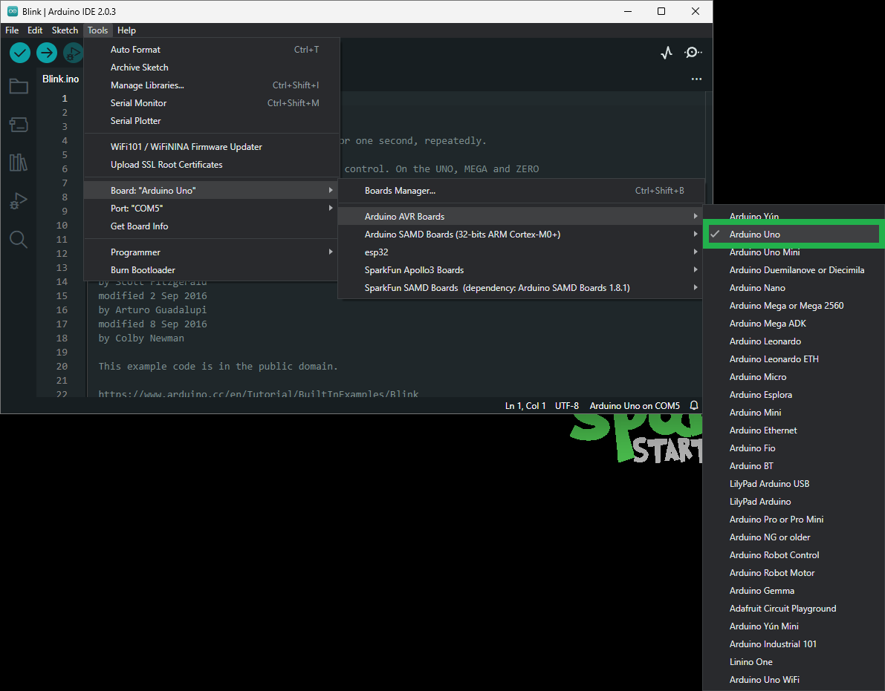

## Arduino IDE
!!! tip
	For first-time users, who have never programmed before and are looking to use the Arduino IDE, we recommend beginning with the <a href="https://www.sparkfun.com/products/15631">SparkFun Inventor's Kit (SIK)</a>, which includes a simple board like the <a href="https://www.sparkfun.com/products/11224">Arduino Uno</a> or <a href="https://www.sparkfun.com/products/15123">SparkFun RedBoard</a> and is designed to help users get started programming with the Arduino IDE.

Most users may already be familiar with the Arduino IDE and its use. However, for those of you who have never heard the name *Arduino* before, feel free to check out the [Arduino website](https://www.arduino.cc/en/Guide/HomePage). To get started with using the Arduino IDE, check out our tutorials below:


<div class="grid cards" markdown align="center">

-   <a href="https://learn.sparkfun.com/tutorials/50">**What is an Arduino?**

	---

	<figure markdown>
	
	</figure></a>

-   <a href="https://learn.sparkfun.com/tutorials/61">**Installing the Arduino IDE**

	---
	
	<figure markdown>
	
	</figure></a>

-   <a href="https://learn.sparkfun.com/tutorials/15">**Installing an Arduino Library**

	---
	
	<figure markdown>
	
	</figure></a>

-   <a href="https://learn.sparkfun.com/tutorials/1265">**Installing Board Definitions in the Arduino IDE**

	---
	
	<figure markdown>
	
	</figure></a>
</div>


??? tip "Need help setting up the RedBoard Plus?"
	### RedBoard Plus
	The following instructions should help users get started with the RedBoard Plus. For more information about the board, please check out our hookup guide below:

	<figure markdown>
	[](https://learn.sparkfun.com/tutorials/1758)
	<figcaption markdown>[**RedBoard Plus Hookup Guide**](https://learn.sparkfun.com/tutorials/1758)</figcaption>
	</figure>


	#### CH340 Driver
	Users will need to install the appropriate driver for their computer to recognize the serial-to-UART chip on their board/adapter. Most of the latest operating systems will recognize the CH340C chip on the board and automatically install the required driver.

	*To manually install the CH340 driver on their computer, users can download it from the [WCH website](http://www.wch-ic.com/products/CH340.html?). For more information, check out our [How to Install CH340 Drivers Tutorial](https://www.sparkfun.com/ch340).*

	<figure markdown>
	[](https://learn.sparkfun.com/tutorials/908)
	<figcaption markdown>[**How to Install CH340 Drivers**](https://learn.sparkfun.com/tutorials/908)</figcaption>
	</figure>


	#### Arduino IDE
	When selecting a board to program in the Arduino IDE, users should select the **Arduino Uno** from the **Tools** drop-down menu _(_i.e. **Tools** > **Board** > **Arduino AVR Boards** > **Arduino Uno**)_.

	<figure markdown>
	[{ width="400" }](./assets/img/software/board_selection.png)
	<figcaption markdown>Select the **Arduino Uno** from the Tools drop-down menu in the Arduino IDE.</figcaption>
	</figure>

	??? info "Arduino IDE 2.x.x - *Alternative Method*"
		In the newest version of the Arduino IDE 2.`x`.`x`, users can also select their board (*green*) and port (*blue*) from the `Select Board & Port` dropdown menu (*yellow*).

		<figure markdown>
		[{ width="400" }](./assets/img/software/board_selection2.png)
		<figcaption markdown>Selecting the **Arduino Uno** and **COM5** port from the **Select Board & Port** drop-down menu in the Arduino IDE (v2.0.3).</figcaption>
		</figure>


### USB Host Library
The [USB Host Library Rev. 2.0](https://github.com/felis/USB_Host_Shield_2.0) can be installed from the library manager in the Arduino IDE.

<figure markdown>
[{ width="400" }](./assets/img/software/arduino_library.png)
<figcaption markdown>USB Host Library in the library manager of the Arduino IDE.</figcaption>
</figure>

!!! info
	For more details about the library, check out the [online documentation](https://felis.github.io/USB_Host_Shield_2.0/).

??? tip "Arduino IDE *(v1.x.x)*"
	In the Arduino IDE v1.x.x, the library manager will have the following appearance for the USB Host Shield library:

	<figure markdown>
	[{ width="400" }](./assets/img/software/arduino_library-legacy.png)
	<figcaption markdown>USB Host Library in the library manager of the Arduino IDE (v1.x.x).</figcaption>
	</figure>

??? note "Alternative Libraries"
	Users are welcome to try other libraries for the MAX3421E, such as the ones listed below. However, our technical support team will only provide assistance with the [USB Host Library Rev. 2.0](https://github.com/felis/USB_Host_Shield_2.0) recommended in this hookup guide.

	* [Arduino-Bluetooth](https://github.com/felis/Arduino-Bluetooth)
	* [Lightweight USB Host](https://github.com/felis/lightweight-usb-host)
	* [MAX3421E project for STM32](https://github.com/jakakordez/max3421e-stm32)

#### Supported Boards
For a detailed and up-to-date list of boards supported by this library, check out the [`README.md` of the GitHub repository](https://github.com/felis/USB_Host_Shield_2.0#boards):

* All official Arduino AVR boards (Uno, Duemilanove, Mega, Mega 2560, Mega ADK, Leonardo etc.)
* Arduino Due
* Teensy (Teensy++ 1.0, Teensy 2.0, Teensy++ 2.0, Teensy 3.x, Teensy LC and Teensy 4.x)
	* For the Teensy 3.x, install this [SPI library](https://github.com/xxxajk/spi4teensy3) and add ```#include <spi4teensy3.h>``` to the `*.ino` sketch file.
* STM32F4
	* Take a look at the following [example code](https://github.com/Lauszus/Nucleo_F446RE_USBHost).
* ESP8266 is supported using the [ESP8266 Arduino core](https://github.com/esp8266/Arduino)
	* Uses pins `15` and `5` for `CS` and `INT`, respectively.
	  * `GPIO6` - `GPIO11` and `GPIO16` are **NOT** usable.
* ESP32 is supported using the [arduino-esp32](https://github.com/espressif/arduino-esp32/)
	* `GPIO5` : `CS`
	* `GPIO17` : `INT`
	* `GPIO18` : `SCK`
	* `GPIO19` : `POCI`
	* `GPIO23` : `PICO`


#### I/O Pin Modifications
The SPI pins used by this library are dictated by [SPI library](https://www.arduino.cc/reference/en/language/functions/communication/spi/) for the Arduino core being utilized and cannot be changed easily. It is recommended that the default pins of the SPI library be utilized.

However, the USB Host Library also declares its `CS` and `INT` pins. These pins can be reconfigured in the library by modifying the [UsbCore.h](https://github.com/felis/USB_Host_Shield_2.0/blob/master/UsbCore.h#L36-L58) file:

```C++
typedef MAX3421e< "CS Pin", "INT Pin" > MAX3421E;
```

For instance, if a user wanted to reconfigure the `CS` pin to `D7` and the `INT` pin to `D2` of the RedBoard Plus *(or any other Arduino Uno/ATmega328P based board)*, [line 58](https://github.com/felis/USB_Host_Shield_2.0/blob/master/UsbCore.h#L58) should read:

```C++
typedef MAX3421e<P7, P2> MAX3421E;
```

!!! tip
	The information above is an example of a pin modification. However, it is not required for the general use of the shield and the examples in this guide. For more information, please refer to the [instructions](https://github.com/felis/USB_Host_Shield_2.0#interface-modifications) in the [`README.md` of the GitHub repository](https://github.com/felis/USB_Host_Shield_2.0#readme).

	??? info "Other Boards"
		For other boards, users will need to modify the lines based on the microcontroller type. For example, with the [SparkFun IoT RedBoard](https://www.sparkfun.com/products/19177) users would need to modify [line 52](https://github.com/felis/USB_Host_Shield_2.0/blob/master/UsbCore.h#L52).